<div align="center">

# Laply

**Formula 1 live timing, schedule and standings for Android, in your status bar, on your lock screen and on your home screen.**

[](#install)
[](https://kotlinlang.org)
[](https://developer.android.com/compose)
[](https://m3.material.io)
[](https://github.com/Spottq/Laply/releases/latest)

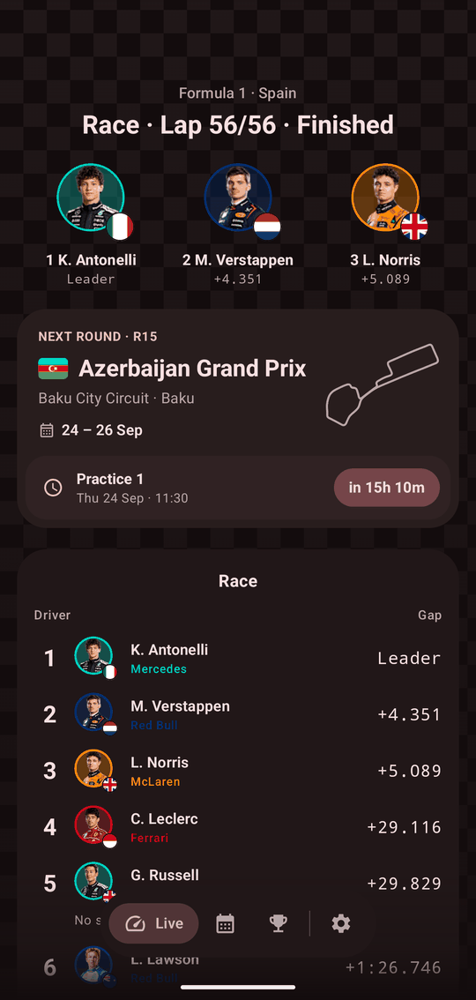
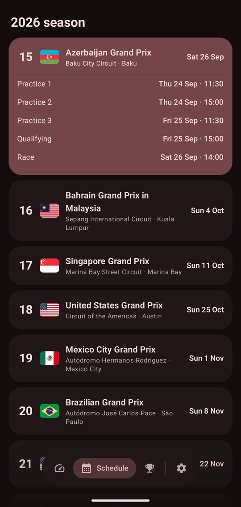
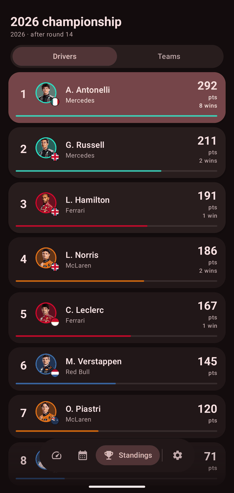

</div>

## Features

- **Live timing**: the official F1 live timing feed (SignalR), with an automatic **ESPN fallback** when that feed is blocked or down, so the classification keeps updating.
- **Automatic Live Update**: follow the season once and Laply opens an ongoing Live Update when each session starts, with the leader, the lap count and the track status in a status-bar chip.
- **MetricStyle on Android 17**: the gaps between the leaders appear as large metrics in the notification. Android 16 shows a segmented progress bar and Android 12 to 15 show a regular ongoing notification.
- **Home-screen widgets**: countdown to the next session and the weekend ahead. Resize the widget from 2x1 up to full screen and it adds more detail as it grows. It uses Material 3 / Monet colours on Pixel and translucent **One UI glass** on Samsung.
- **Samsung lock-screen widgets**: next session and countdown on the lock screen, AOD and the Flip/Fold cover screen, plus a 2x2 layout on tablets and foldables.
- **Tablets and foldables**: two-pane Live layout with the circuit map and conditions next to the classification.
- **Schedule, results and standings**: the full season calendar in your time zone, session results and driver and team championships.
- **Modern Android**: Material 3 Expressive, dynamic colour (Monet) or F1 red, light/dark/system theme, predictive back and edge-to-edge.
- **Update checker**: a daily check against GitHub Releases posts a notification when a new version is out. You can turn it off, or check by hand, in Settings → About.

## Screenshots

### Live Update · Android 17 MetricStyle

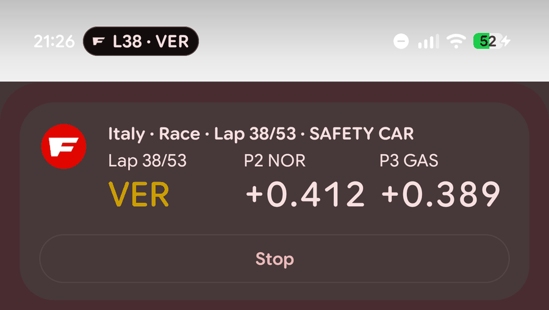

### Widgets

| Material 3 · Pixel | One UI glass · Samsung |
|---|---|
| 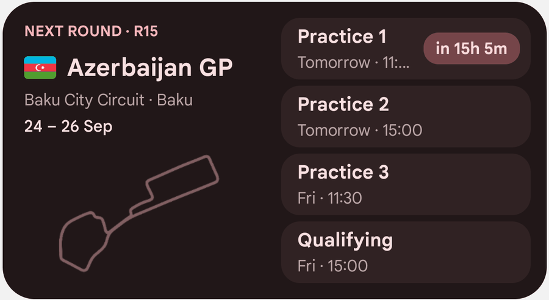 | 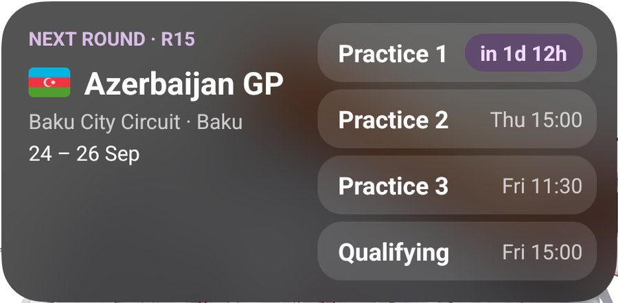 |
| 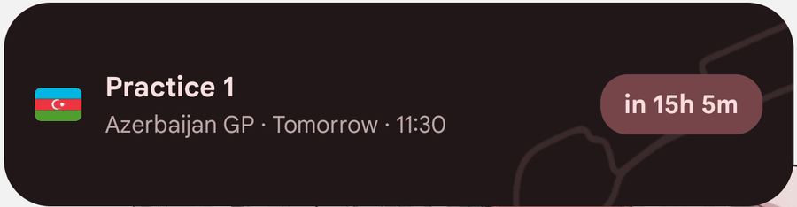 | 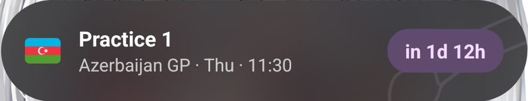 |

| 2x1 · One UI | Lock screen · One UI |
|---|---|
| 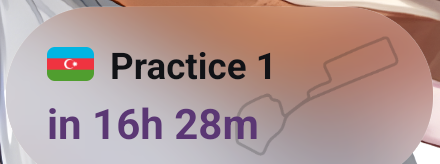 | 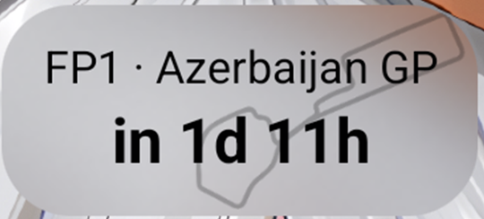 |

### Tablets and foldables

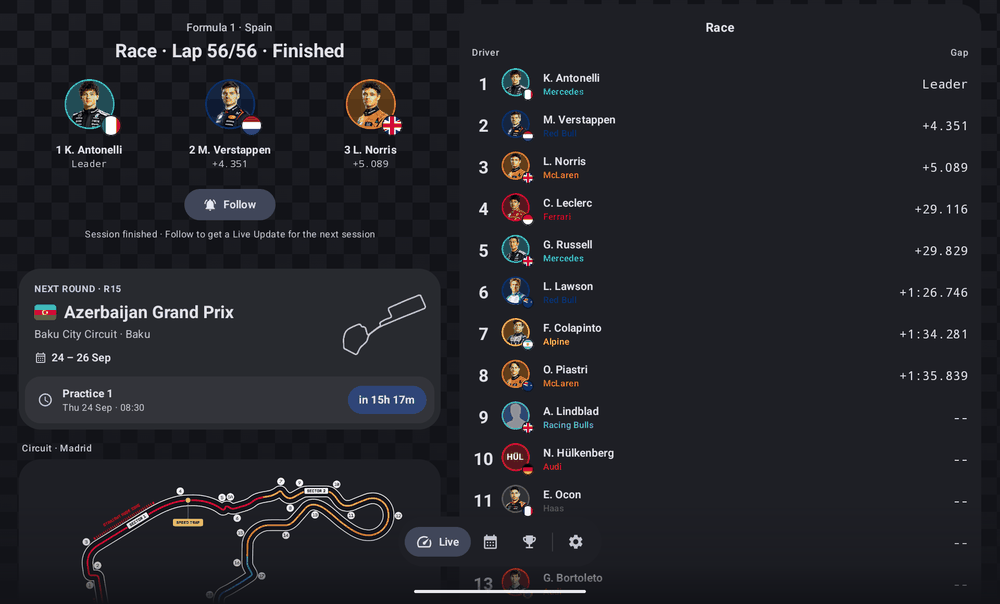

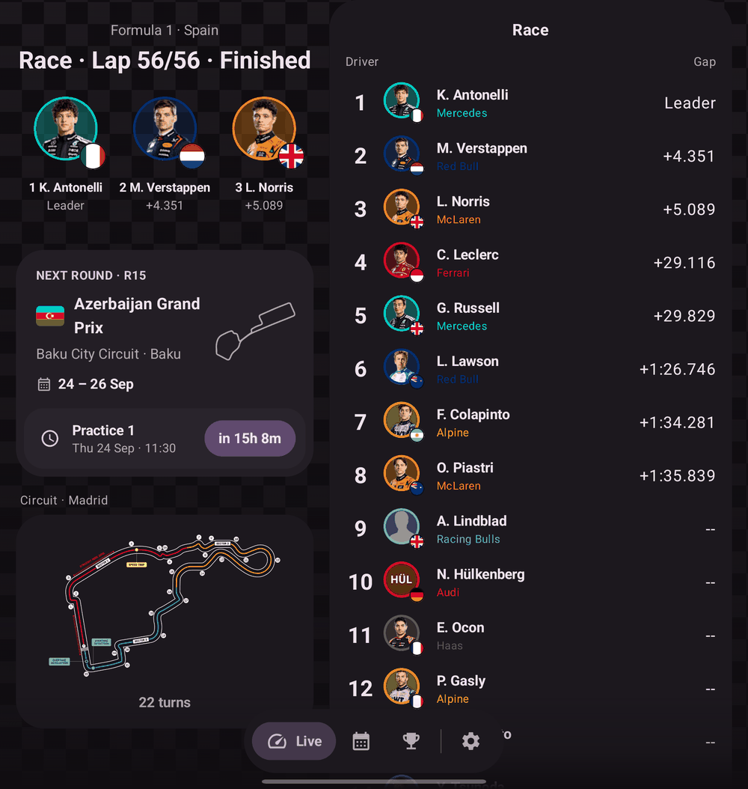

### Settings

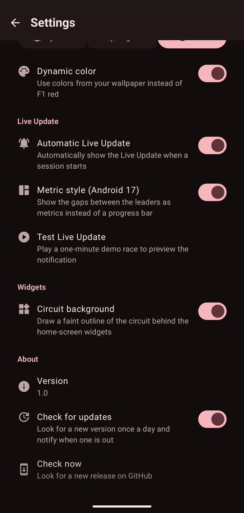

## Install

1. Download `Laply-x.y.apk` from the [latest release](https://github.com/Spottq/Laply/releases/latest).
2. Open it on your phone and allow installs from your browser or file manager when Android asks.
3. Allow notifications when you tap **Follow** so Live Updates can appear.

Requires Android 12 (API 31) or newer. MetricStyle needs Android 17 and the promoted Live Update chip needs Android 16. Laply checks for new releases once a day and notifies you when one is out.

## Build

You need JDK 21 and the Android SDK (platform 37).

```sh
./gradlew :app:assembleDebug        # app/build/outputs/apk/debug/app-debug.apk
./gradlew :app:testDebugUnitTest
./gradlew :app:assembleRelease      # signed with the debug key, for sideloading
```

Requires JDK 21 (Android Studio's bundled JBR works): set `JAVA_HOME`, or `org.gradle.java.home` in your user-level `~/.gradle/gradle.properties`.

## Data sources

| Data | Source |
|---|---|
| Live timing | F1 live timing, SignalR Core (`livetiming.formula1.com`), unauthenticated topics only |
| Fallback live timing | ESPN's public scoreboard / core APIs |
| Schedule, results, standings | [Jolpica](https://github.com/jolpica/jolpica-f1) (Ergast-compatible API) |
| Driver photos, team logos, circuit maps | `media.formula1.com` |
| Circuit maps (fallback) | Wikipedia / Wikimedia Commons |
| Flags | [flagcdn.com](https://flagcdn.com) |

The live feed is unofficial and undocumented. It can change or close without notice.

## Credits

The Samsung One UI widget integration builds on these MIT-licensed projects:

- [twidget](https://github.com/thatjoshguy67/twidget), © Josh Skinner: lock-screen widget provider, One UI metadata and long-press settings.
- [blur-widget-demo](https://github.com/thatjoshguy67/blur-widget-demo), © Josh Skinner: One UI Home background blur and cell-size info.
- Codex-Meter, © its authors: Samsung lock-screen widget support and the ServiceBox receiver.

## License

TBD. No license has been chosen yet, so all rights are reserved by the author for now.

## Disclaimer

Laply is an unofficial fan project and is not associated with Formula 1 companies. F1, FORMULA ONE and related marks are trademarks of Formula One Licensing B.V.
